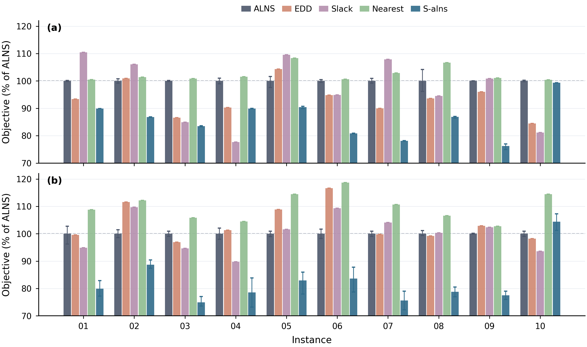

# S-alns: Reproducible Figure 1 Benchmark

This open-source research repository compares a conventional adaptive large-neighborhood search
(ALNS) baseline with the proposed service-structure-guided ALNS (S-alns) for a
UAV--UGV two-echelon distribution problem. It releases all **20 Figure 1
configurations** (10 synthetic physical instances x 2 cost profiles), fixed
experiment settings, complete reference CSV results, and the plotting script.

`S-alns` is the algorithm's display name throughout this repository. The
machine-readable identifier used in Python and CSV files is `s_alns`.



Lower values are better. Every objective is normalized by the mean ALNS
objective for the same instance and cost profile. Error bars are seed-bootstrap
95% confidence intervals for ALNS and S-alns. EDD, minimum-slack, and nearest are
deterministic construction heuristics and therefore have no artificial seed
error bars.

## Complete 20-configuration release

The primary release is the complete Figure 1 experiment, not only the favorable
example. It contains 200 stochastic runs:

- 10 physical instances;
- 2 cost profiles (commercial and emergency);
- 2 methods (ALNS and S-alns);
- 5 paired seeds;
- 500 iterations per run.

S-alns is better on the instance-level mean in 19/20 configurations. The released
exception is `instance_20260110 + emergency`, where S-alns is 4.39% worse on
average and wins only 1/5 seeds. It is retained in the data and Figure 1.

See `data/case_matrix.csv` for the twenty configurations and
`results/reference/figure1_summary.csv` for their complete summary.

## Featured quick-start case

The default experiment is:

- instance: `instance_20260103` (55 customers, 7 candidate hubs);
- profile: `emergency` (UAV and UGV running costs only; capital costs are zero);
- budget: 500 ALNS iterations;
- paired seeds: `42, 7, 123, 2024, 99`.

This optional quick-start case is the most favorable combination in the
released Figure 1 scan. S-alns reduces the final objective by **25.05% on
average**, wins **5/5 paired seeds**,
and has a minimum seed-level reduction of **20.16%**. It was selected after the
10-instance x 2-profile study, rather than preregistered; the complete scan is
included to make that selection transparent.

The strongest commercial case is `instance_20260109`: S-alns reduces the
investment-plus-running-cost objective by **23.76% on average** and wins 5/5
paired seeds.

See [RESULTS.md](RESULTS.md) for the measured values and claim boundary.

## Installation

Python 3.9 or newer is recommended. No commercial optimizer is required.

```bash
python -m venv .venv
```

Linux/macOS:

```bash
source .venv/bin/activate
python -m pip install --upgrade pip
python -m pip install -r requirements.txt
```

Alternatively, create the pinned-compatible Conda environment:

```bash
conda env create -f environment.yml
conda activate s-alns
```

Windows PowerShell:

```powershell
.venv\Scripts\Activate.ps1
python -m pip install --upgrade pip
python -m pip install -r requirements.txt
```

## Reproduce the bundled figure

The committed reference CSV files make this command fast; it does not rerun
the solver:

```bash
python scripts/plot_figure1.py
```

Outputs:

- `figures/figure1_reproduced.pdf`
- `figures/figure1_reproduced.png`
- `figures/figure1_reproduced_plot_data.csv`

## Run the featured comparison from scratch

The following command runs 2 methods x 5 paired seeds x 500 iterations:

```bash
python scripts/run_experiment.py
```

Results are written to `results/generated/featured/`. Runtime depends strongly
on the CPU; use the smoke test below before starting the full run.

```bash
python scripts/run_experiment.py --seeds 42 --n-iter 5 \
  --out results/generated/smoke
```

To run the strongest commercial case:

```bash
python scripts/run_experiment.py --instances 20260109 \
  --profiles commercial --out results/generated/commercial09
```

## Recompute the complete Figure 1 study

The full solver experiment consists of 10 instances x 2 profiles x 2 methods
x 5 paired seeds. It is intentionally explicit and may take several hours on a
single CPU process.

```bash
python scripts/run_experiment.py --instances all \
  --profiles commercial,emergency --seeds 42,7,123,2024,99 \
  --n-iter 500 --out results/generated/full --resume

python scripts/run_priority_rules.py --instances all \
  --profiles commercial,emergency \
  --out results/generated/priority_rules

python scripts/plot_figure1.py \
  --search-results results/generated/full/run_results.csv \
  --priority-results results/generated/priority_rules/priority_results.csv \
  --out figures/figure1_full
```

`--resume` reuses combinations already present in `run_results.csv`.

## Experimental controls

For every paired baseline--S-alns comparison, the instance, cost profile,
iteration budget, random seed, simulated-annealing schedule, feasibility
validator, and objective function are identical. S-alns additionally builds the
service structure and uses the service-guided initialization and search
operators configured in `config/amortized.yaml`.

Cost profiles:

- `commercial`: hub, UAV, and UGV amortized capital costs plus running costs;
- `emergency`: capital-cost coefficients set to zero, retaining UAV and UGV
  running costs.

The reference results are feasible incumbents produced by the heuristic. They
are not claimed global optima.

## Repository layout

```text
config/                 fixed ALNS and service-structure settings
data/instances/         ten synthetic instance/parameter pairs
figures/                reference Figure 1
results/reference/      committed 500-iteration CSV results
scripts/run_experiment.py
scripts/run_priority_rules.py
scripts/plot_figure1.py
src/                    solver implementation
tests/                  initialization and feasibility smoke tests
```

## Tests

```bash
python -m unittest discover -s tests -v
```

GitHub Actions runs the same smoke tests and regenerates Figure 1 from the
committed CSV files.

## Scope

These instances implement the paper's UAV--UGV synchronization, endurance,
release-time, and cost structure. Classical 2E-VRP objective values are not
mixed into Figure 1 because they use different models and instances. A
classical benchmark comparison requires a separate model adapter.

## License

Copyright (c) 2026 Feiyu Yang (`feiyu@cafuc.edu.cn`).

The complete repository, including source code, synthetic instances, reference
results, and figures, is released under the [MIT License](LICENSE). It permits
use, modification, distribution, sublicensing, and commercial use provided the
copyright and license notices are retained.

For academic work, please cite the metadata in [CITATION.cff](CITATION.cff) and
the associated paper when available. This citation request does not add a
restriction to the MIT License.
